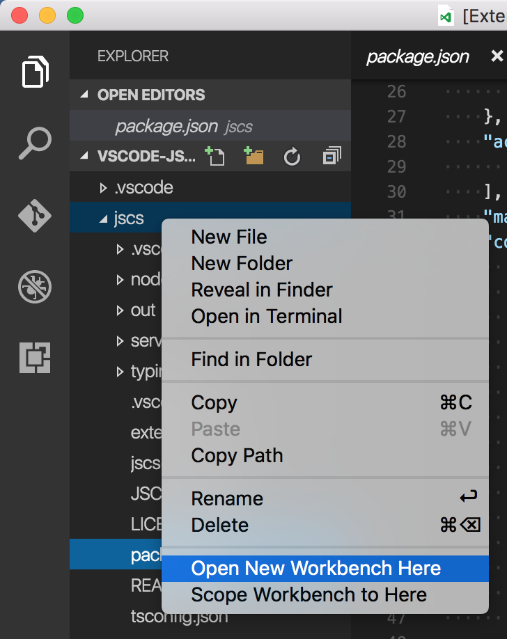

# Open Folder Context Menus

## Features

This extension adds two new context menus to the Explorer Viewlet:

* **Open New Workbench Here**: Opens a new instance of VS Code scoped to the selected folder OR to the folder containing the selected file.
* **Scope Workbench to Here**: Reopens VS Code scoped to the selected folder. This feature only works on folders, it has no effect when a file is selected.

## Using

Right click on a folder or file in the Explorer, choose **Open New Workbench Here** or **Scope Workbench to Here**.

## License

[MIT](LICENSE.md)
