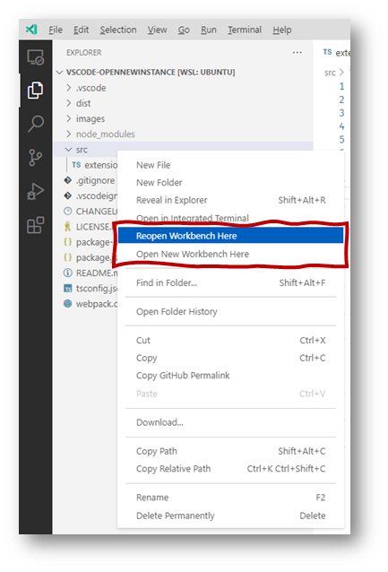

# Open Folder Context Menus

## Features

This extension adds two new context menus to the Explorer Viewlet:

* **Open New Workbench Here**: Opens a new instance of VS Code scoped to the selected folder OR to the folder containing the selected file.
* **Reopen Workbench Here**: Reopens VS Code scoped to the selected folder. This feature only works on folders, it has no effect when a file is selected.

## Using

Right click on a folder or file in the Explorer, choose **Open New Workbench Here** or **Reopen Workbench Here**.

## Changelog

### 0.0.5
* Add icon
* Update TypeScript, VS Code engine, etc.
* Webpack

### 0.0.2
* Move commands to navigation section, fixes [Issue 1](https://github.com/chrisdias/vscode-opennewinstance/issues/1)
* Change command "Scope Workbench to Here" to "Reopen Workbench Here"

## License

[MIT](LICENSE.md)
